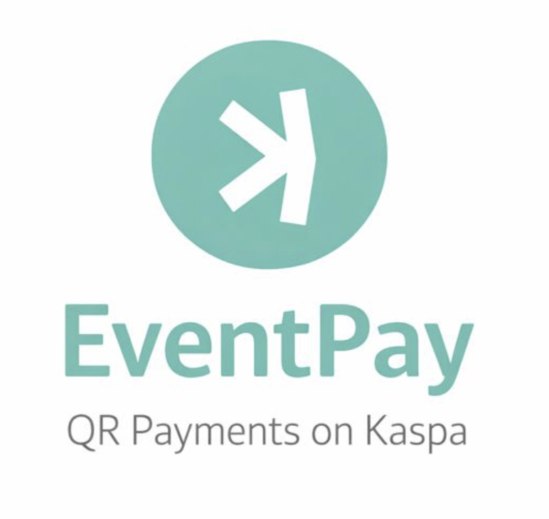

  

# EventPay  
### Real-time, QR-based payments for festivals and live events — powered by Kaspa

---

## Overview

EventPay is a lightweight payment system designed for festivals, cultural events, and high-traffic venues where traditional crypto wallets are too complex and existing cashless systems are often centralized, opaque, or expensive.

EventPay enables instant, QR-based payments using Kaspa’s real-time blockchain, without requiring end users to create or manage a crypto wallet.

---

## Problem

Festivals and events face recurring payment challenges:

- Long queues and friction at points of sale  
- Complex onboarding for crypto-native solutions  
- Centralized cashless systems with high fees and limited transparency  

---

## Solution

EventPay abstracts blockchain complexity while preserving its benefits.

- QR-based user interaction  
- Preloaded credits  
- Instant confirmation  
- Transparent settlement on Kaspa  

The blockchain works in the background. Users never see it.

---

## How It Works

1. Users preload credits before or during the event  
2. Payments are made by scanning QR codes  
3. Transactions are aggregated and settled on Kaspa  
4. Credits can be reused across multiple events  

---

## Architecture (High Level)

- Web interface (no wallet required)
- Backend credit ledger
- Kaspa node for real-time settlement

Kaspa is used as the settlement layer, not as a user-facing asset.

---

## Volatility Handling

User credits are denominated in fiat value.  
Kaspa exposure is managed at the system level through conversion windows and treasury buffering.

Users never interact with volatile pricing.

---

## Use Cases

- Music festivals  
- Cultural events  
- Artist tipping  
- Community-driven venues  

---

## Hackathon Context

Submitted to **Kaspathon: Build at Internet Speed**.

This repository currently represents a concept-first architecture and system design.  
An MVP implementation is planned as the next phase.

---

## License

MIT (to be finalized)

## MVP Roadmap

**Phase 1 – Event Wallet Core**
- Web-based Event Wallet (no user crypto wallet required)
- User credit balances denominated in fiat value
- QR-based payments for vendors and artist tipping
- Central event treasury holding Kaspa liquidity

**Phase 2 – Real-Time Settlement**
- Instant Kaspa transactions for vendor settlement
- Event-level dashboards for organizers
- Treasury buffering to minimize price exposure

**Phase 3 – Multi-Event Credits**
- Reusable credits across multiple events
- Optional user accounts for frequent attendees
- Cross-event balance portability

  ## Transaction Flow (Simplified)

1. User tops up credits on the EventPay website using fiat (EUR / CHF / USD).
2. Credits are assigned to the user account in fiat value.
3. EventPay treasury converts fiat to Kaspa at predefined intervals.
4. At the event, the user scans a QR code to pay vendors or tip artists.
5. Vendor balances are updated instantly.
6. Vendors can settle to Kaspa or fiat after the event.
